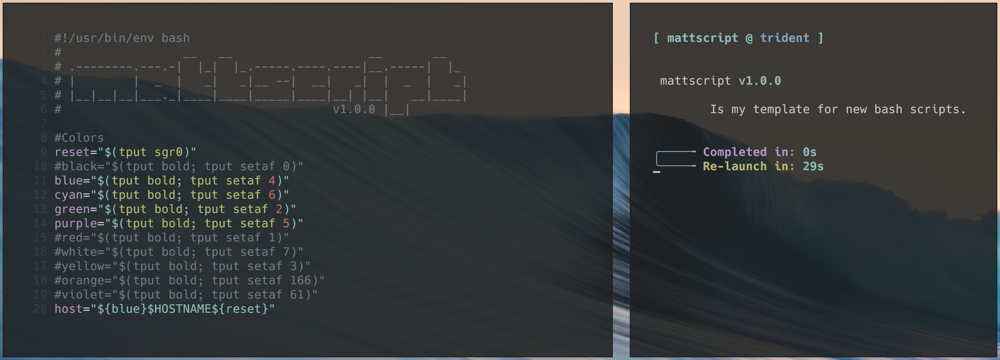

# mattscript

    mattscript v1.0.0

        Is my template for new bash scripts.

    Usage: ./mattscript.sh [--help|--version]

    [options]
            --license       Show license information.
            --about         What is mattscript?
